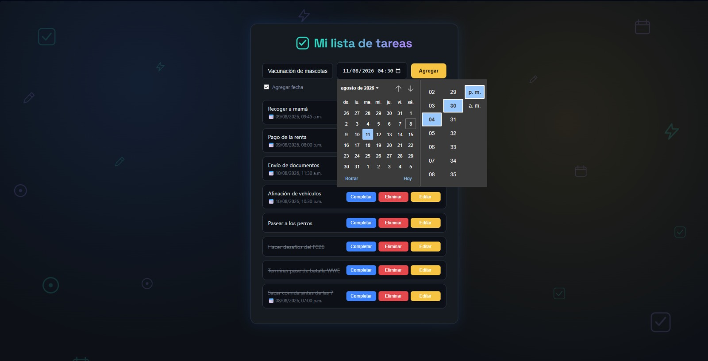

# ✅ Mi Lista de Tareas

Aplicación web para organizar el día a día: agrega tareas, ponles fecha y hora, márcalas como completadas, edítalas o elimínalas — todo con una interfaz oscura y moderna, sin recargar la página en ningún momento.

## 🚀 Demo en vivo

👉 [Ver la app funcionando](https://MaxVF97.github.io/Lista-de-tareas/)

## ✨ Funcionalidades

- ➕ Agregar tareas escribiendo y presionando **Enter** o el botón **Agregar**
- 🚫 Validación de campo vacío (no se agregan tareas en blanco)
- 📅 Fecha y hora opcional por tarea, con checkbox para mostrarla u ocultarla
- ✔️ Marcar/desmarcar tareas como completadas (con texto tachado)
- ✏️ Edición de tareas directamente sobre el texto
- 🗑️ Eliminar tareas individualmente
- 🎨 Interfaz oscura moderna con acentos en azul y amarillo, totalmente responsiva

## 🛠️ Tecnologías

Construido con **HTML, CSS y JavaScript puro (Vanilla JS)** — sin frameworks ni librerías externas. Todo el comportamiento (agregar, editar, completar, eliminar) está hecho con manipulación directa del DOM y delegación de eventos.

## 📚 Lo que practiqué en este proyecto

- Manipulación del DOM (`getElementById`, `innerHTML`, `classList`)
- Delegación de eventos con `addEventListener` y `event.target`
- Estados dinámicos de UI (`contentEditable`, clases condicionales)
- Validación de formularios en el cliente
- Diseño responsivo con Flexbox y variables/temas en CSS

## 📸 Vista previa

---

Proyecto hecho como parte de mi aprendizaje de desarrollo web front-end.
